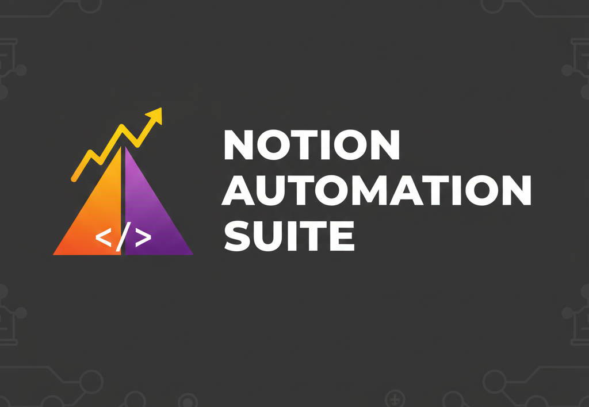

<div align="center">
  
</div>

<div align="center">
  <a href="https://github.com/LucasBiason/notion-automation-suite/releases"></a>
  <a href="https://github.com/LucasBiason/notion-automation-suite/blob/main/pyproject.toml"></a>
  <a href="https://github.com/LucasBiason/notion-automation-suite/actions"></a>
  <a href="LICENSE"></a>
</div>

# Notion MCP Server

Servidor MCP enxuto para automatizar fluxos do Notion via Model Context Protocol. Ele encapsula regras de negócio específicas das bases e expõe tools compatíveis com Cursor e outros agentes MCP.

## Visão geral

- **Domínios suportados:** trabalho, estudos, pessoal e conteúdo.
- **Regras embutidas:** validação de título, status, relações, períodos e horários antes da chamada HTTP.
- **Tecnologias:** Python 3.10+, `httpx`, `tenacity`, `structlog`, `pytest`, `mcp`.
- **Runtime:** [FastMCP](https://smithery.ai/docs/cookbooks/python_custom_container) com suporte stdio/SSE/HTTP.
- **Integração:** execução via stdio (`notion-mcp-server`) e container Docker pronto para uso.

## Estrutura do repositório

```
notion-automation-suite/
├── src/
│   ├── custom/        # Regras por domínio (Work, Studies, Personal, Youtuber)
│   ├── services/      # Wrapper da API do Notion
│   ├── tools/         # Definição das tools MCP
│   ├── runtime/       # Fabricação FastMCP, carga de env e logging
│   ├── utils/         # Constantes, validações e formatadores
│   ├── exceptions/    # Exceções específicas do serviço
│   └── notion_mcp.py  # Compatibilidade com imports antigos
├── tests/
│   ├── custom/
│   ├── services/
│   ├── tools/
│   └── conftest.py
├── docs/
│   ├── README.md
│   └── mcp/           # Documentação detalhada
└── pyproject.toml
```

## Configuração do ambiente

1. **Clonar o repositório:**
   ```bash
   git clone https://github.com/LucasBiason/notion-automation-suite.git
   cd notion-automation-suite
   ```

2. **Criar ambiente virtual e instalar dependências:**
   ```bash
   python -m venv .venv
   source .venv/bin/activate
   pip install -e .[dev]
   ```

3. **Configurar variáveis do Notion:**
   - Copie `config/env.example` (caso exista) para `config/.env` ou defina as variáveis manualmente.
   - Campos esperados:
     - `NOTION_API_TOKEN`
     - `NOTION_WORK_DATABASE_ID`
     - `NOTION_STUDIES_DATABASE_ID`
     - `NOTION_PERSONAL_DATABASE_ID`
     - `NOTION_YOUTUBER_DATABASE_ID`

4. **Executar o servidor localmente:**
   ```bash
   notion-mcp-server
   ```
   O comando carrega o ambiente, inicializa logging e disponibiliza o loop stdio.

## Execução via Docker

```bash
docker build -t notion-mcp-server .
docker run -i --rm \
  -e NOTION_API_TOKEN=secret_xxx \
  -e NOTION_WORK_DATABASE_ID=... \
  -e NOTION_STUDIES_DATABASE_ID=... \
  -e NOTION_PERSONAL_DATABASE_ID=... \
  -e NOTION_YOUTUBER_DATABASE_ID=... \
  notion-mcp-server
```

## Testes

- Execute `make test` para rodar a suíte (unit + integration).
- `ruff`, `mypy` e demais ferramentas podem ser disparadas via `make lint`/`make type` caso configurados.

## Documentação

A documentação completa está em [`docs/`](docs/README.md) e inclui:

- Visão geral e objetivos (`docs/mcp/README.md`)
- Arquitetura detalhada (`docs/mcp/ARCHITECTURE.md`)
- Referência de API (`docs/mcp/API.md`)
- Guia de configuração no Cursor (`docs/mcp/SETUP_CURSOR.md`)
- Exemplos práticos (`docs/mcp/EXAMPLES.md`)
- Roadmap e próximos passos (`docs/mcp/ROADMAP.md`)

## Integração com agentes

Este repositório expõe apenas o MCP. Qualquer coordenação de agentes e configurações específicas deve acontecer em [`cursor-multiagent-system`](../cursor-multiagent-system), que consome este servidor como backend de automação.

## Manutenção

- Ajuste regras de negócio sempre adicionando testes correspondentes.
- Atualize a documentação após mudanças relevantes.
- Mantenha os tokens e IDs fora do versionamento (`config/private/` permanece ignorado).
